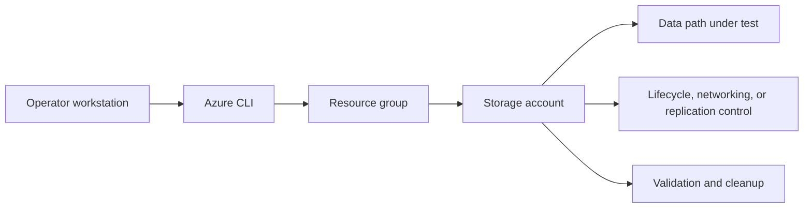

---
hide:
  - toc
content_sources:
  diagrams:
    - id: tutorials-lab-guides-lab-05-static-website-cdn
      type: flowchart
      source: mslearn-adapted
      mslearn_url: https://learn.microsoft.com/en-us/azure/storage/blobs/storage-blob-static-website
---

# Lab 05: Static Website with CDN

Enable the static website feature on Blob storage, upload sample site content, and place a CDN endpoint in front of the origin to test caching and global delivery basics.

## Prerequisites

- Azure subscription with permission to create storage, networking, and monitoring resources.
- Azure CLI logged in with the correct tenant and subscription.
- Variables defined for `$RG`, `$LOCATION`, `$STORAGE_NAME`, and any lab-specific names.
- A workstation or Cloud Shell session with access to the resource group.
- Optional Log Analytics workspace if you want to capture diagnostics during the lab.

## Architecture Diagram

<!-- diagram-id: tutorials-lab-guides-lab-05-static-website-cdn -->


## Step-by-Step Instructions

### Step 1: Create the storage account and enable static website hosting

```bash
az storage account create \
    --resource-group $RG \
    --name $STORAGE_NAME \
    --location $LOCATION \
    --sku Standard_LRS \
    --kind StorageV2 \
    --access-tier Hot \
    --output json

az storage blob service-properties update \
    --account-name $STORAGE_NAME \
    --static-website \
    --index-document index.html \
    --404-document error.html \
    --output json
```

- Record the output and any IDs you will reuse in later steps.
- If the command creates security-sensitive settings, confirm they match policy before moving on.
- Capture screenshots or JSON output for your lab notes if you are building internal training material.
### Step 2: Upload the website files

```bash
az storage blob upload-batch \
    --account-name $STORAGE_NAME \
    --destination \$web \
    --source ./lab-data/static-site \
    --pattern "*.html" \
    --output table
```

- Record the output and any IDs you will reuse in later steps.
- If the command creates security-sensitive settings, confirm they match policy before moving on.
- Capture screenshots or JSON output for your lab notes if you are building internal training material.
### Step 3: Create a CDN profile and endpoint

```bash
az cdn profile create \
    --resource-group $RG \
    --name $CDN_PROFILE_NAME \
    --sku Standard_Microsoft \
    --location global \
    --output json

az cdn endpoint create \
    --resource-group $RG \
    --profile-name $CDN_PROFILE_NAME \
    --name $CDN_ENDPOINT_NAME \
    --origin $STORAGE_NAME.z13.web.core.windows.net \
    --origin-host-header $STORAGE_NAME.z13.web.core.windows.net \
    --output json
```

- Record the output and any IDs you will reuse in later steps.
- If the command creates security-sensitive settings, confirm they match policy before moving on.
- Capture screenshots or JSON output for your lab notes if you are building internal training material.
### Step 4: Purge CDN cache after content changes

```bash
az cdn endpoint purge \
    --resource-group $RG \
    --profile-name $CDN_PROFILE_NAME \
    --name $CDN_ENDPOINT_NAME \
    --content-paths "/*"
```

- Record the output and any IDs you will reuse in later steps.
- If the command creates security-sensitive settings, confirm they match policy before moving on.
- Capture screenshots or JSON output for your lab notes if you are building internal training material.

## Validation Steps

1. Confirm the storage account properties match the intended SKU, kind, and access posture.
2. Validate the lab-specific feature from the consumer point of view rather than trusting only control-plane success.
3. Capture one or more JSON outputs that prove the configuration is active.
4. Record any timing behavior that matters, especially for lifecycle or replication scenarios.
5. Note the operational follow-up required before using the same pattern in production.

### Example validation commands

```bash
az storage account show \
    --resource-group $RG \
    --name $STORAGE_NAME \
    --output json
```

```bash
az monitor diagnostic-settings list \
    --resource $(az storage account show --resource-group $RG --name $STORAGE_NAME --query id --output tsv) \
    --output json
```

## Cleanup Instructions

- Delete lab resources when validation is complete to prevent ongoing cost.
- Preserve any JSON output or screenshots you need before deletion.
- If you created role assignments or network links used elsewhere, confirm scope before removing them.

```bash
az group delete \
    --name $RG \
    --yes \
    --no-wait
```

## See Also

- [Blob Best Practices](../../best-practices/blob-best-practices.md)
- [AzCopy and Data Movement](../../operations/azcopy-and-data-movement.md)
- [Cost Optimization Best Practices](../../best-practices/cost-optimization-best-practices.md)

## Sources

- [azure/storage/blobs/storage-blob-static-website](https://learn.microsoft.com/en-us/azure/storage/blobs/storage-blob-static-website)
- [azure/cdn/cdn-create-new-endpoint](https://learn.microsoft.com/en-us/azure/cdn/cdn-create-new-endpoint)
