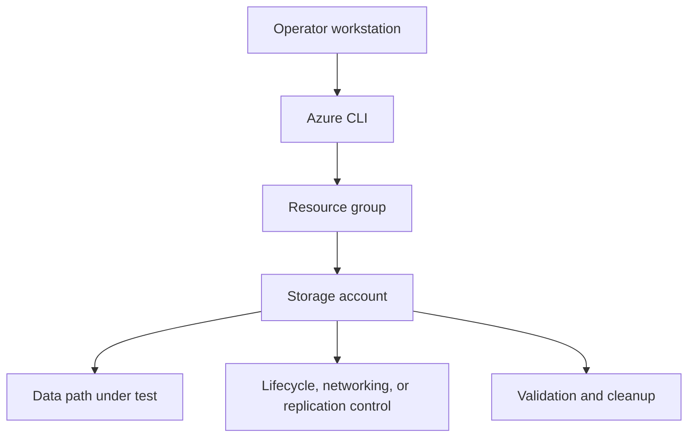

---
content_sources:
  diagrams:
    - id: tutorials-lab-guides-lab-05-static-website-cdn
      type: flowchart
      source: mslearn-adapted
      mslearn_url: https://learn.microsoft.com/en-us/azure/storage/blobs/storage-blob-static-website
validation:
  az_cli:
    last_tested:
    result: not_tested
  bicep:
    last_tested:
    result: not_tested
---

# Lab 05: Static Website with CDN

Enable the static website feature on Blob storage, upload sample site content, and place a CDN endpoint in front of the origin to test caching and global delivery basics.

## Prerequisites

- Azure subscription with permission to create storage, networking, and monitoring resources.
- Azure CLI logged in with the correct tenant and subscription.
- Variables defined for `$RG`, `$LOCATION`, `$STORAGE_NAME`, and any lab-specific names.
- A workstation or Cloud Shell session with access to the resource group.
- Optional Log Analytics workspace if you want to capture diagnostics during the lab.

## Architecture Diagram

<!-- diagram-id: tutorials-lab-guides-lab-05-static-website-cdn -->

```mermaid
flowchart TD
    A[Operator workstation] --> B[Azure CLI]
    B --> C[Resource group]
    C --> D[Storage account]
    D --> E[Data path under test]
    D --> F[Lifecycle, networking, or replication control]
    D --> G[Validation and cleanup]
```

## Step-by-Step Instructions

### Step 1: Create the storage account and enable static website hosting

```bash
az storage account create \
    --resource-group $RG \
    --name $STORAGE_NAME \
    --location $LOCATION \
    --sku Standard_LRS \
    --kind StorageV2 \
    --access-tier Hot \
    --output json

az storage blob service-properties update \
    --account-name $STORAGE_NAME \
    --static-website \
    --index-document index.html \
    --404-document error.html \
    --output json
```

| Command | Purpose |
| --- | --- |
| `az storage account create` | Create a storage account for static website hosting. |
| `--resource-group` | Resource group that will contain the account. |
| `--name` | Globally unique name of the storage account. |
| `--location` | Azure region for the account. |
| `--sku` | Redundancy tier, locally redundant Standard (`Standard_LRS`). |
| `--kind` | Account kind, `StorageV2` for general-purpose v2. |
| `--access-tier` | Default blob access tier (`Hot`). |
| `--output` | Output format for the result. |
| `az storage blob service-properties update` | Update blob service properties to enable static website hosting. |
| `--account-name` | Name of the storage account to configure. |
| `--static-website` | Enable the static website feature. |
| `--index-document` | Default index document served for the site. |
| `--404-document` | Custom error document served for missing paths. |
| `--output` | Output format for the result. |


After this step, record the primary static-website endpoint URL (`primaryEndpoints.web` on the storage account) — Step 3 fronts this origin with the CDN.

### Step 2: Upload the website files

```bash
mkdir -p lab-data/static-site
cat > lab-data/static-site/index.html <<'EOF'
<!DOCTYPE html>
<html lang="en">
<head><meta charset="utf-8"><title>Storage Lab</title></head>
<body><h1>Azure Storage static website lab</h1><p>Origin content served from Blob Storage.</p></body>
</html>
EOF
cat > lab-data/static-site/error.html <<'EOF'
<!DOCTYPE html>
<html lang="en">
<head><meta charset="utf-8"><title>Not Found</title></head>
<body><h1>404</h1><p>The requested path is not present in the sample site.</p></body>
</html>
EOF

az storage blob upload-batch \
    --account-name $STORAGE_NAME \
    --destination \$web \
    --source ./lab-data/static-site \
    --pattern "*.html" \
    --output table
```

| Command | Purpose |
| --- | --- |
| `az storage blob upload-batch` | Upload site files to the static website container. |
| `--account-name` | Name of the destination storage account. |
| `--destination` | Target container, the reserved `$web` static website container. |
| `--source` | Local directory whose files are uploaded. |
| `--pattern` | Glob pattern selecting files to upload (`*.html`). |
| `--output` | Output format for the result. |


After this step, confirm `index.html` (and any error document) uploaded to the `$web` container and loads over the static-website endpoint.

### Step 3: Create a CDN profile and endpoint

```bash
az cdn profile create \
    --resource-group $RG \
    --name $CDN_PROFILE_NAME \
    --sku Standard_Microsoft \
    --location global \
    --output json

az cdn endpoint create \
    --resource-group $RG \
    --profile-name $CDN_PROFILE_NAME \
    --name $CDN_ENDPOINT_NAME \
    --origin $STORAGE_NAME.z13.web.core.windows.net \
    --origin-host-header $STORAGE_NAME.z13.web.core.windows.net \
    --output json
```

| Command | Purpose |
| --- | --- |
| `az cdn profile create` | Create an Azure CDN profile. |
| `--resource-group` | Resource group that will contain the CDN resources. |
| `--name` | Name of the CDN profile to create. |
| `--sku` | CDN pricing tier (`Standard_Microsoft`). |
| `--location` | Location for the profile (`global`). |
| `--output` | Output format for the result. |
| `az cdn endpoint create` | Create a CDN endpoint fronting the static website origin. |
| `--resource-group` | Resource group that contains the CDN profile. |
| `--profile-name` | CDN profile that owns the endpoint. |
| `--name` | Name of the CDN endpoint to create. |
| `--origin` | Origin hostname, the static website endpoint. |
| `--origin-host-header` | Host header sent to the origin. |
| `--output` | Output format for the result. |


After this step, note the CDN endpoint hostname; allow time for propagation before expecting it to serve content from the origin.

### Step 4: Purge CDN cache after content changes

```bash
az cdn endpoint purge \
    --resource-group $RG \
    --profile-name $CDN_PROFILE_NAME \
    --name $CDN_ENDPOINT_NAME \
    --content-paths "/*"
```

| Command | Purpose |
| --- | --- |
| `az cdn endpoint purge` | Purge cached content from a CDN endpoint. |
| `--resource-group` | Resource group that contains the CDN endpoint. |
| `--profile-name` | CDN profile that owns the endpoint. |
| `--name` | Name of the CDN endpoint to purge. |
| `--content-paths` | Paths to purge (`/*` for everything). |


After this step, confirm the purge operation completed; cached paths may take a few minutes to reflect the refreshed origin content.

## Validation Steps

1. Confirm the storage account properties match the intended SKU, kind, and access posture.
2. Validate the lab-specific feature from the consumer point of view rather than trusting only control-plane success.
3. Capture one or more JSON outputs that prove the configuration is active.
4. Record any timing behavior that matters, especially for lifecycle or replication scenarios.
5. Note the operational follow-up required before using the same pattern in production.

### Example validation commands

```bash
az storage account show \
    --resource-group $RG \
    --name $STORAGE_NAME \
    --output json
```

| Command | Purpose |
| --- | --- |
| `az storage account show` | Show full properties of the storage account. |
| `--resource-group` | Resource group that contains the account. |
| `--name` | Name of the storage account to inspect. |
| `--output` | Output format for the result. |


```bash
az monitor diagnostic-settings list \
    --resource $(az storage account show --resource-group $RG --name $STORAGE_NAME --query id --output tsv) \
    --output json
```

| Command | Purpose |
| --- | --- |
| `az monitor diagnostic-settings list` | List diagnostic settings configured on a resource. |
| `--resource` | Resource ID being inspected, here the storage account. |
| `--output` | Output format for the result. |


## Cleanup Instructions

- Delete lab resources when validation is complete to prevent ongoing cost.
- Preserve any JSON output or screenshots you need before deletion.
- If you created role assignments or network links used elsewhere, confirm scope before removing them.

```bash
az group delete \
    --name $RG \
    --yes \
    --no-wait
```

| Command | Purpose |
| --- | --- |
| `az group delete` | Delete a resource group and all resources in it. |
| `--name` | Name of the resource group to delete. |
| `--yes` | Skip the interactive confirmation prompt. |
| `--no-wait` | Return immediately without waiting for deletion to finish. |


## See Also

- [Blob Best Practices](../../best-practices/blob-best-practices.md)
- [AzCopy and Data Movement](../../operations/azcopy-and-data-movement.md)
- [Cost Optimization Best Practices](../../best-practices/cost-optimization-best-practices.md)

## Sources

- [azure/storage/blobs/storage-blob-static-website](https://learn.microsoft.com/en-us/azure/storage/blobs/storage-blob-static-website)
- [azure/cdn/cdn-create-new-endpoint](https://learn.microsoft.com/en-us/azure/cdn/cdn-create-new-endpoint)
