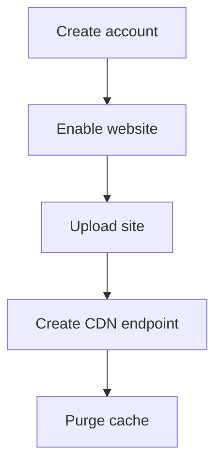

---
content_sources:
  diagrams:
    - id: tutorials-lab-guides-lab-05-static-website-cdn
      type: flowchart
      source: mslearn-adapted
      mslearn_url: https://learn.microsoft.com/en-us/azure/storage/blobs/storage-blob-static-website
validation:
  az_cli:
    last_tested: null
    cli_version: null
    result: not_tested
  bicep:
    last_tested: null
    result: not_tested
---

# Lab 05: Static Website with CDN

Enable static website hosting, upload sample HTML, and configure a CDN endpoint against the discovered web endpoint host.

## Lab Metadata

| Field | Value |
|---|---|
| Difficulty | Intermediate |
| Duration | 60-75 minutes |
| Services | Blob static website, Azure CDN |
| Validation status | Not tested in a live subscription |

## Prerequisites

- Azure CLI authenticated to the intended tenant and subscription.
- Variables from this lab are set before running commands.
- The resource group is dedicated to the lab so cleanup is safe.
- The lab validation status is intentionally `not_tested` until the full sequence is executed in Azure.

## What You Will Build

<!-- diagram-id: tutorials-lab-guides-lab-05-static-website-cdn -->

```mermaid
flowchart TD
    A[Create account]
    B[Enable website]
    A --> B
    C[Upload site]
    B --> C
    D[Create CDN endpoint]
    C --> D
    E[Purge cache]
    D --> E
```

## Steps

### Step 1: Create the account and enable static website hosting

| Command | Purpose |
|---|---|
| `az storage account create` | Creates the StorageV2 account. |
| `az storage blob service-properties update` | Enables static website hosting on the Blob service. |

```bash
az storage account create \
    --resource-group $RG \
    --name $STORAGE_NAME \
    --location $LOCATION \
    --sku Standard_LRS \
    --kind StorageV2 \
    --access-tier Hot \
    --output json

az storage blob service-properties update \
    --account-name $STORAGE_NAME \
    --static-website \
    --index-document index.html \
    --404-document 404.html \
    --output json
```

### Step 2: Upload static website files

| Command | Purpose |
|---|---|
| `az storage blob upload-batch` | Uploads the sample HTML files into the special static website container. |

```bash
az storage blob upload-batch \
    --account-name $STORAGE_NAME \
    --destination '$web' \
    --source ./lab-data/static-site \
    --pattern "*.html" \
    --output table
```

### Step 3: Create and test CDN endpoint

| Command | Purpose |
|---|---|
| `az cdn profile create` | Creates a CDN profile for the lab. |
| `az cdn endpoint create` | Creates the CDN endpoint using the discovered static website host. |
| `az cdn endpoint purge` | Purges cached content after a content change. |

```bash
STATIC_HOST=$(az storage account show --resource-group $RG --name $STORAGE_NAME --query primaryEndpoints.web --output tsv | sed 's#^https://##; s#/$##')

az cdn profile create \
    --resource-group $RG \
    --name $CDN_PROFILE_NAME \
    --sku Standard_Microsoft \
    --location global \
    --output json

az cdn endpoint create \
    --resource-group $RG \
    --profile-name $CDN_PROFILE_NAME \
    --name $CDN_ENDPOINT_NAME \
    --origin $STATIC_HOST \
    --origin-host-header $STATIC_HOST \
    --output json

az cdn endpoint purge \
    --resource-group $RG \
    --profile-name $CDN_PROFILE_NAME \
    --name $CDN_ENDPOINT_NAME \
    --content-paths "/*"
```

## Verification

| Command | Purpose |
|---|---|
| `verification command` | Collects evidence that the lab configuration exists and matches the expected state. |

```bash
az storage account show \
    --resource-group $RG \
    --name $STORAGE_NAME \
    --query "primaryEndpoints.web" \
    --output tsv

az cdn endpoint show \
    --resource-group $RG \
    --profile-name $CDN_PROFILE_NAME \
    --name $CDN_ENDPOINT_NAME \
    --query "{hostName:hostName,originHostHeader:originHostHeader}" \
    --output json
```

## Next Steps / Clean Up

- Preserve command output needed for your lab notes.
- Do not execute destructive failover or delete commands in shared subscriptions without approval.
- Delete the resource group when the lab is complete if it contains only lab resources.

| Command | Purpose |
|---|---|
| `az group delete` | Deletes lab resources after you confirm the resource group is dedicated to this lab. |

```bash
az group delete \
    --name $RG \
    --yes
```

## See Also

- [Azcopy And Data Movement](../../operations/azcopy-and-data-movement.md)
- [Networking Best Practices](../../best-practices/networking-best-practices.md)

## Sources

- [Microsoft Learn source](https://learn.microsoft.com/en-us/azure/storage/blobs/storage-blob-static-website)
